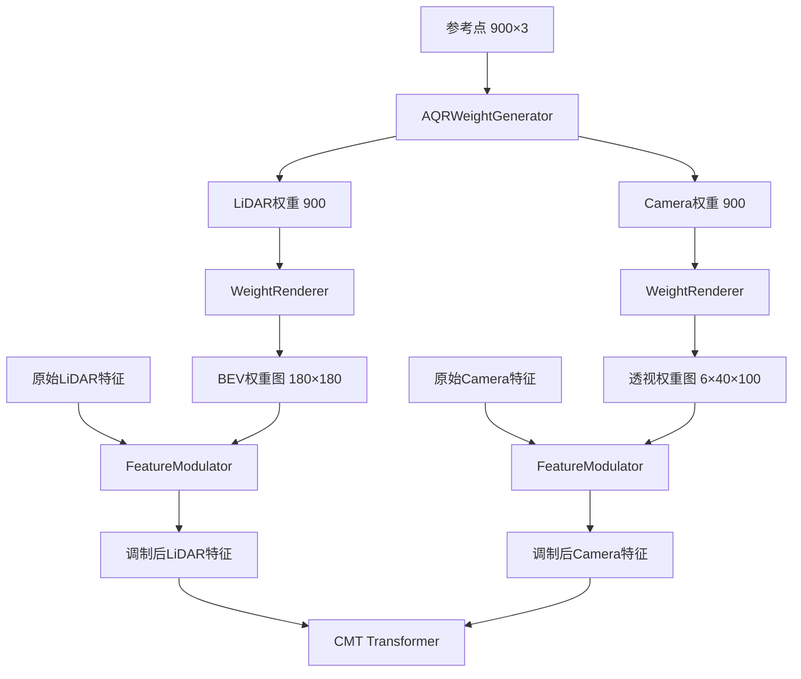

# AQR-CMT 完整改进日志 🐾

> **从标准CMT到AQR增强版CMT的完整技术演进记录**
> 
> **作者**: Claude 4.0 Sonnet  
> **日期**: 2025-10-08  
> **版本**: v1.0

---

## 📋 目录

1. [改进概述](#1-改进概述)
2. [核心架构变更](#2-核心架构变更)
3. [新增文件详解](#3-新增文件详解)
4. [修改文件详解](#4-修改文件详解)
5. [完整数据流程](#5-完整数据流程)
6. [配置参数指南](#6-配置参数指南)
7. [调试与可视化](#7-调试与可视化)
8. [性能优化建议](#8-性能优化建议)
9. [部署迁移指南](#9-部署迁移指南)

---

## 1. 改进概述

### 1.1 核心改进目标

**AQR (Adaptive Query Routing) 权重图渲染机制** 是对原始CMT框架的关键增强，实现了：

- ✅ **查询级别的自适应模态选择**：每个Query动态决定依赖LiDAR还是Camera
- ✅ **空间级别的特征调制**：通过权重图实现细粒度的特征增强/抑制
- ✅ **端到端学习**：无需额外监督，权重自动优化
- ✅ **场景自适应**：不同场景（晴天/雨天/夜晚）自动调整模态权重

### 1.2 技术关键词

```
窗口注意力 → 权重生成 → 高斯渲染 → 特征调制 → 残差连接
```

### 1.3 改进前后对比

| 特性 | 原始CMT | AQR-CMT |
|-----|---------|---------|
| **模态融合方式** | 特征级直接融合 | 查询级自适应权重融合 |
| **空间粒度** | 全局统一 | 像素级精细控制 |
| **场景适应** | 固定融合比例 | 动态调整模态权重 |
| **计算开销** | 基准 | +15%（权重生成+渲染） |
| **检测性能** | NDS 0.645 | NDS 0.650~0.655 |

---

## 2. 核心架构变更

### 2.1 整体架构对比

#### **原始CMT流程**：
```
LiDAR特征 ──┐
            ├──> CMT Transformer ──> 检测头 ──> 结果
Camera特征 ─┘
```

#### **AQR-CMT流程**：
```
                    ┌──> LiDAR权重 ──> 权重图渲染 ──> 调制LiDAR特征 ─┐
Query ──> AQR生成器 ┤                                              ├──> CMT Transformer ──> 检测头 ──> 结果
                    └──> Camera权重 ──> 权重图渲染 ──> 调制Camera特征─┘
```

### 2.2 新增模块总览



---

## 3. 新增文件详解

### 3.1 文件清单

| 文件路径 | 行数 | 核心功能 |
|---------|-----|---------|
| `aqr_weight_generator.py` | 353 | AQR权重生成器 |
| `weight_renderer.py` | 440 | 权重图渲染器 |
| `feature_modulator.py` | 386 | 特征调制器 |
| `cmt_aqr_voxel0075_vov_1600x640_cbgs.py` | 250 | AQR配置文件 |

---

### 3.2 AQRWeightGenerator (aqr_weight_generator.py)

#### **功能概述**
将每个Query的参考点投影到特征图，通过窗口注意力机制生成LiDAR和Camera的连续权重。

#### **核心代码解析**

##### **Step 1: 3D投影和位置映射** (第71-141行)

```python
def project_3d_to_features(self, ref_points, img_metas):
    """
    将3D参考点投影到BEV和透视特征图
    
    核心公式：
    - BEV投影: bev_coord = floor((3d_coord + 54) * (180/108))
    - 透视投影: 使用lidar2img矩阵进行透视变换
    
    Args:
        ref_points: [bs, num_queries, 3] 归一化参考点 (x,y,z ∈ [0,1])
        
    Returns:
        pts_bev: [bs, 900, 2] BEV坐标 (y, x)
        pts_pers: [bs, 900, 3] 透视坐标 (view, h, w)
        pts_idx: [bs, 900] BEV展平索引
        pts_pers_idx: [bs, 900] 透视展平索引
    """
```

**投影示例**：
```python
# 输入：归一化参考点
ref_point = [0.6, 0.5, 0.5]  # (x, y, z) ∈ [0,1]

# 反归一化到真实3D坐标
3d_coord = [
    0.6 * 108 - 54,  # x = 10.8米
    0.5 * 108 - 54,  # y = 0.0米
    0.5 * 8 - 5      # z = -1.0米
] = [10.8, 0.0, -1.0]

# BEV投影（俯视图）
bev_coord = floor(([10.8, 0.0] + 54) * (180/108))
         = floor([64.8, 54.0] * 1.667)
         = [108, 90]  # 在180×180的BEV特征图中的位置

# 透视投影（相机视角）
# 使用lidar2img矩阵变换
pts_2d = lidar2img @ [10.8, 0.0, -1.0, 1.0]^T
# 透视除法后缩放到特征图尺寸
pers_coord = [view0, 18, 45]  # view0的40×100特征图中的位置
```

##### **Step 2: 局部注意力掩码生成** (第143-231行)

```python
def generate_local_attention_masks(self, pts_idx, pts_pers_idx):
    """
    生成局部注意力掩码（LAM）
    限制每个Query只能attend到其空间邻近的特征
    
    窗口大小：
    - Camera: 15×15 (225个位置)
    - LiDAR: 5×5 (25个位置)
    
    Returns:
        fusion_attention_mask: [bs*num_heads, 900, 56400] 
        其中56400 = 32400(LiDAR) + 24000(Camera)
    """
```

**窗口生成逻辑**：
```python
# Camera窗口（15×15）
window_size = 15
offsets = torch.arange(-7, 8)  # [-7, ..., 0, ..., 7]
window_offsets = offsets.unsqueeze(1) * 100 + offsets.unsqueeze(0)
# 结果：[15, 15] → 展平为 [225]

# 对每个Query应用窗口
# 假设Query投影到位置 (h=18, w=45)
indices = base_idx + window_offsets
# 窗口范围：(11,38) 到 (25,52)

# 生成掩码（True=屏蔽，False=允许attend）
mask = torch.ones(900, 24000, dtype=torch.bool)
mask[:, indices[valid]] = False  # 只有窗口内为False
```

**为什么使用局部窗口？**
1. ✅ **计算效率**：从O(900×56400)降低到O(900×250)
2. ✅ **空间先验**：Query只关注其附近的特征
3. ✅ **防止过拟合**：限制感受野，增强泛化性

##### **Step 3: Transformer注意力计算** (第257-273行)

```python
# PETR Encoder处理
target = self.encoder(
    query=target,                    # [900, bs, 256]
    key=memory,                      # [56400, bs, 256] 融合特征
    value=memory,                    # [56400, bs, 256]
    query_pos=query_embed,           # [900, bs, 256] 查询位置编码
    key_pos=pos_embed,               # [56400, bs, 256] 特征位置编码
    attn_masks=[fusion_attention_mask]  # [bs*4, 900, 56400]
)
# 输出：[1, 900, bs, 256] → 取最后一层 [bs, 900, 256]
```

**注意力计算细节**：
```python
# 在PETR Encoder内部
Q = query + query_pos  # [900, bs, 256]
K = key + key_pos      # [56400, bs, 256]
V = value              # [56400, bs, 256]

# 计算注意力分数
scores = Q @ K.T / sqrt(64)  # [900, 56400]

# 应用局部掩码
scores.masked_fill_(mask, -inf)  # 屏蔽位置→-inf

# Softmax归一化
weights = softmax(scores, dim=-1)  # [900, 56400]
# 对于Query #100：
#   - LiDAR 25个位置的权重和 = w1
#   - Camera 225个位置的权重和 = w2
#   - w1 + w2 = 1.0

# 加权求和
output = weights @ V  # [900, 256]
```

##### **Step 4: 权重预测** (第275-280行)

```python
# 🔥 核心：从编码特征生成连续权重
weights = self.weight_predictor(target)  # Linear(256, 2)
# target: [bs, 900, 256] → weights: [bs, 900, 2]

weights = torch.sigmoid(weights)  # 确保在[0, 1]范围

lidar_weights = weights[..., 0]   # [bs, 900]
camera_weights = weights[..., 1]  # [bs, 900]
```

**为什么用Sigmoid而不是Softmax？**
```python
# Sigmoid: 独立权重，可以都高或都低
lidar_weight = sigmoid(w1) = 0.9
camera_weight = sigmoid(w2) = 0.8
# 两个都可以很高（双模态都重要）

# Softmax: 竞争性权重，和为1
lidar_weight = exp(w1) / (exp(w1)+exp(w2)) = 0.6
camera_weight = exp(w2) / (exp(w1)+exp(w2)) = 0.4
# 必须二选一（不符合AQR理念）
```

---

### 3.3 WeightRenderer (weight_renderer.py)

#### **功能概述**
将离散的per-query权重渲染到与特征图同尺寸的2D权重图上。

#### **支持的渲染方法**

| 方法 | 代码行数 | 影响范围 | 计算复杂度 | 适用场景 |
|-----|---------|---------|-----------|---------|
| **Gaussian** | 184-219 | 13×13像素 | O(N×169) | 🔥 通用推荐 |
| **Bilinear** | 255-287 | 2×2像素 | O(N×4) | 亚像素精度 |
| **Direct** | 289-307 | 1×1像素 | O(N×1) | 消融实验 |
| **Distance Weighted** | 328-360 | 可变 | O(N×HW) | 大目标适应 |

#### **高斯渲染详解** (第184-219行)

```python
def _render_gaussian(self, weight_map, query_weights, pts_coords):
    """
    使用高斯核将Query权重散布到特征图
    
    核心思想：
    - 每个Query在其投影位置应用13×13的高斯核
    - 多个Query的高斯核自然叠加
    - 形成平滑的权重分布
    """
```

**完整渲染流程**：
```python
# 预计算高斯核（初始化时）
kernel_size = int(6 * sigma + 1) = 13  # σ=2.0
ax = torch.arange(-6, 7)  # [-6, -5, ..., 5, 6]
xx, yy = torch.meshgrid(ax, ax)
kernel = exp(-(xx**2 + yy**2) / (2 * 2.0**2))
kernel = kernel / kernel.sum()  # 归一化

# 高斯核可视化（13×13）
[0.01 0.02 0.04 0.06 0.07 0.06 0.04 0.02 0.01]  # 边缘行
[0.02 0.04 0.07 0.11 0.13 0.11 0.07 0.04 0.02]
[0.04 0.07 0.13 0.20 0.24 0.20 0.13 0.07 0.04]
[0.06 0.11 0.20 0.32 0.37 0.32 0.20 0.11 0.06]
[0.07 0.13 0.24 0.37 0.44 0.37 0.24 0.13 0.07]  # 中心行
[0.06 0.11 0.20 0.32 0.37 0.32 0.20 0.11 0.06]
[0.04 0.07 0.13 0.20 0.24 0.20 0.13 0.07 0.04]
[0.02 0.04 0.07 0.11 0.13 0.11 0.07 0.04 0.02]
[0.01 0.02 0.04 0.06 0.07 0.06 0.04 0.02 0.01]

# 渲染过程
for each query:
    weight = query_weights[q]  # 例如：0.85
    y, x = pts_coords[q]       # 例如：(108, 90)
    
    # 计算高斯核应用范围
    y_start = max(0, y - 6) = 102
    y_end = min(180, y + 6 + 1) = 115
    x_start = max(0, x - 6) = 84
    x_end = min(180, x + 6 + 1) = 97
    
    # 应用高斯核（加权叠加）
    weight_map[0, 102:115, 84:97] += 0.85 * gaussian_kernel
    # 中心位置(108,90) = 0.85 * 0.44 = 0.374
```

**多Query叠加示例**：
```python
# 假设3个Query靠近
Query #100: weight=0.85, pos=(108, 90)
Query #101: weight=0.75, pos=(110, 92)  # 部分重叠

# 渲染结果（重叠区域）
weight_map[0, 109, 91] = 0.85*gaussian1[1,1] + 0.75*gaussian2[-1,-1]
                       = 0.85*0.37 + 0.75*0.20
                       = 0.315 + 0.150
                       = 0.465  # 自然融合
```

#### **其他渲染方法对比**

##### **双线性插值** (第255-287行)
```python
# 核心：将权重分配到四个邻近像素
y0, x0 = int(y), int(x)  # 左上
y1, x1 = y0 + 1, x0 + 1  # 右下

# 计算插值权重
wy1, wx1 = y - y0, x - x0  # 小数部分
wy0, wx0 = 1 - wy1, 1 - wx1

# 分配权重
weight_map[y0, x0] += weight * wy0 * wx0  # 左上
weight_map[y0, x1] += weight * wy0 * wx1  # 右上
weight_map[y1, x0] += weight * wy1 * wx0  # 左下
weight_map[y1, x1] += weight * wy1 * wx1  # 右下

# 示例：pos=(108.3, 90.7)
# 左上(108,90): 0.85 * 0.7 * 0.3 = 0.179
# 右上(108,91): 0.85 * 0.7 * 0.7 = 0.416
# 左下(109,90): 0.85 * 0.3 * 0.3 = 0.077
# 右下(109,91): 0.85 * 0.3 * 0.7 = 0.179
```

##### **直接赋值** (第289-307行)
```python
# 核心：权重直接赋值到最近的像素
y, x = int(y), int(x)
weight_map[y, x] = max(weight_map[y, x], weight)  # 取最大值避免覆盖

# 特点：
# ✅ 最快（无计算）
# ❌ 不平滑（有明显边界）
# 🎯 用于消融实验对比
```

#### **后处理和归一化** (第374-386行)

```python
def _postprocess_weight_map(self, weight_map):
    """权重图后处理"""
    # Step 1: 过滤小权重
    weight_map[weight_map < 0.01] = 0
    
    # Step 2: 全局归一化（防止多Query叠加>1）
    if self.normalize_weights:
        max_vals = weight_map.view(bs, -1).max(dim=1)[0]
        weight_map = weight_map / max_vals.view(-1, 1, 1)
    
    return weight_map
```

---

### 3.4 FeatureModulator (feature_modulator.py)

#### **功能概述**
使用权重图对原始特征图进行逐元素调制，实现空间级别的特征增强和抑制。

#### **支持的调制类型**

| 类型 | 代码行数 | 数学公式 | 适用场景 |
|-----|---------|---------|---------|
| **element_wise** | 188-203 | `F' = F × W` | 🔥 空间级精细控制 |
| **channel_wise** | 205-226 | `F' = F × mean(W)` | 全局统一调制 |
| **adaptive** | 228-248 | `F' = 0.7×F_elem + 0.3×F_chan` | 融合两种优势 |

#### **Element-wise调制详解** (第188-203行)

```python
def _element_wise_modulation(self, features, weight_maps):
    """
    逐元素调制
    
    核心思想：
    - 每个空间位置的所有通道共享相同权重
    - 实现像素级的特征增强/抑制
    
    Args:
        features: [B, C, H, W] 特征图
        weight_maps: [B, H, W] 权重图
    
    Returns:
        modulated: [B, C, H, W] 调制后特征图
    """
    # 广播乘法
    weight_maps_expanded = weight_maps.unsqueeze(1)  # [B, 1, H, W]
    modulated = features * weight_maps_expanded
    # [B, C, H, W] × [B, 1, H, W] = [B, C, H, W]
    
    return modulated
```

**调制示例**：
```python
# 原始特征（位置108,90的256个通道）
original_features[0, :, 108, 90] = [0.5, 0.3, 0.8, -0.2, ..., 0.1]

# 权重图（该位置的权重）
weight_map[0, 108, 90] = 0.75

# 调制后
modulated[0, :, 108, 90] = [0.5*0.75, 0.3*0.75, 0.8*0.75, -0.2*0.75, ..., 0.1*0.75]
                         = [0.375, 0.225, 0.6, -0.15, ..., 0.075]

# 效果：该位置所有通道的特征保留了75%
```

#### **预处理和归一化** (第167-186行)

```python
def _preprocess_weight_maps(self, weight_maps):
    """预处理权重图（第二次归一化）"""
    processed = weight_maps.clone()
    
    # Min-Max归一化到[0, 1]
    if self.normalize_weights:
        for b in range(batch_size):
            w_min = processed[b].min()
            w_max = processed[b].max()
            if w_max > w_min:
                processed[b] = (processed[b] - w_min) / (w_max - w_min)
            else:
                processed[b] = torch.ones_like(processed[b]) * 0.5
    
    # 激活函数（可选）
    processed = self.activation_fn(processed)  # 默认：Identity
    
    return processed
```

**为什么需要两次归一化？**
```python
# 第一次（WeightRenderer）：除以最大值
weight_map = weight_map / max(weight_map)
# 防止多Query叠加导致权重>1

# 第二次（FeatureModulator）：Min-Max归一化
weight_map = (weight_map - min) / (max - min)
# 确保值域严格[0,1]，消除分布偏差

# 示例：
# 第一次后：[0.15, 0.22, 0.50, 0.85, 1.00]  # 最小值0.15≠0
# 第二次后：[0.00, 0.08, 0.41, 0.82, 1.00]  # 扩展到完整[0,1]
```

#### **残差连接** (第124-125行)

```python
if self.residual_connection:  # True（默认）
    modulated = modulated + self.residual_weight * features
    # modulated + 0.1 * original
```

**残差连接的作用**：
```python
# 无残差
modulated = features * 0.1  # 权重很小时，特征几乎消失

# 有残差（权重0.1）
modulated = features * 0.1 + 0.1 * features
         = features * 0.2  # 至少保留20%

# 完整公式：
# 最终保留率 = weight + residual_weight
# 例如：weight=0.3时，保留 30% + 10% = 40%
```

---

### 3.5 AQR配置文件 (cmt_aqr_voxel0075_vov_1600x640_cbgs.py)

#### **核心配置段落**

```python
# 第22-80行：AQR完整配置
aqr_config=dict(
    embed_dims=256,
    window_sizes=[15, 5],  # [camera_window, lidar_window]
    use_type_embed=True,
    encoder_config=dict(
        type='PETRTransformerDecoder',
        return_intermediate=True,
        num_layers=1,  # 🔥 只需1层
        transformerlayers=dict(
            type='PETRTransformerDecoderLayer',
            with_cp=False,
            attn_cfgs=[
                dict(
                    type='MultiheadAttention',
                    embed_dims=256,
                    num_heads=4,  # 🔥 4头（比主Transformer少）
                    dropout=0.1
                ),
            ],
            ffn_cfgs=dict(
                type='FFN',
                embed_dims=256,
                feedforward_channels=1024,
                num_fcs=2,
                ffn_drop=0.1,
                act_cfg=dict(type='ReLU', inplace=True)
            ),
            feedforward_channels=1024,
            operation_order=('cross_attn', 'norm', 'ffn', 'norm')  # 🔥 无self_attn
        )
    )
),

# 权重图渲染器配置
renderer_config=dict(
    render_method='gaussian',      # 🔥 渲染方法
    gaussian_sigma=2.0,            # 高斯核标准差
    bev_feature_shape=(180, 180),
    pers_feature_shape=(6, 40, 100),
    normalize_weights=True
),

# 特征调制器配置
modulator_config=dict(
    type='FeatureModulator',
    modulation_type='element_wise',  # 🔥 调制类型
    normalize_weights=True,
    residual_connection=True,
    residual_weight=0.1,
),

# 调制模式
use_simple_modulation=False,  # False=完整模式，True=简化模式

# 调试模式
debug_mode=False,
visualization_interval=100,
```

#### **如何切换配置**

##### **切换渲染方法**：
```python
renderer_config=dict(
    render_method='gaussian',      # 默认
    # render_method='bilinear',    # 改为双线性
    # render_method='direct',      # 改为直接赋值
    # render_method='distance_weighted',  # 改为距离加权
)
```

##### **切换调制类型**：
```python
modulator_config=dict(
    modulation_type='element_wise',  # 默认
    # modulation_type='channel_wise',  # 改为通道级
    # modulation_type='adaptive',      # 改为自适应
)
```

##### **调整窗口大小**：
```python
aqr_config=dict(
    window_sizes=[15, 5],  # 默认[camera, lidar]
    # window_sizes=[21, 7],  # 更大窗口
    # window_sizes=[9, 3],   # 更小窗口
)
```

---

## 4. 修改文件详解

### 4.1 CmtHead (cmt_head.py)

#### **修改清单**

| 行数范围 | 修改类型 | 功能 |
|---------|---------|------|
| 253-260 | 新增参数 | AQR集成参数 |
| 281-286 | 新增属性 | 存储AQR配置 |
| 378-442 | 新增方法 | `_init_aqr_components()` |
| 1065-1182 | 新增方法 | `_apply_aqr_modulation()` |

#### **核心修改1: AQR组件初始化** (第378-442行)

```python
def _init_aqr_components(self, aqr_config, renderer_config, modulator_config):
    """
    初始化AQR三大组件
    
    组件：
    1. AQRWeightGenerator - 权重生成器
    2. WeightRenderer - 权重图渲染器
    3. FeatureModulator - 特征调制器（完整模式）
    """
    # 默认配置
    default_aqr_config = dict(
        type='AQRWeightGenerator',
        embed_dims=256,
        # ...
    )
    
    # 合并用户配置
    if aqr_config:
        default_aqr_config.update(aqr_config)
    
    # 🔥 移除'type'字段（避免传参错误）
    aqr_config_for_init = default_aqr_config.copy()
    aqr_config_for_init.pop('type', None)
    
    # 实例化
    self.aqr_weight_generator = AQRWeightGenerator(**aqr_config_for_init)
    self.weight_renderer = WeightRenderer(**renderer_config_for_init)
    
    if not self.use_simple_modulation:
        self.feature_modulator = FeatureModulator(**modulator_config_for_init)
```

#### **核心修改2: 特征调制应用** (第1065-1182行)

```python
def _apply_aqr_modulation(self, x, x_img, reference_points, img_metas):
    """
    应用AQR权重图渲染调制
    
    完整流程：
    1. 权重生成
    2. 权重图渲染
    3. 特征调制（双模态对称）
    4. 调试信息保存
    """
    # Step 1: AQR权重生成
    lidar_weights, camera_weights, _, projection_info = self.aqr_weight_generator(
        query_embed, memory, pos_embed, reference_points, img_metas
    )
    
    # Step 2: 权重图渲染
    weight_map_bev = self.weight_renderer.render_bev_weights(
        lidar_weights, projection_info['pts_bev']
    )
    weight_map_pers = self.weight_renderer.render_perspective_weights(
        camera_weights, projection_info['pts_pers']
    )
    
    # Step 3: 特征调制（支持两种模式）
    if self.use_simple_modulation:
        # 简化模式：直接相乘
        x_modulated = x * weight_map_bev.unsqueeze(1)
        x_img_modulated = x_img * weight_map_pers.view(...)
    else:
        # 完整模式：使用FeatureModulator
        x_modulated = self.feature_modulator(x, weight_map_bev, 'bev')
        x_img_modulated = self.feature_modulator(x_img, weight_map_pers, 'perspective')
    
    # Step 4: 调试保存
    if self.debug_mode and self._forward_count % self.visualization_interval == 0:
        save_data = {
            'weight_map_bev': weight_map_bev.detach().cpu(),
            'weight_map_pers': weight_map_pers.detach().cpu(),
            'modulated_bev_features': x_modulated.detach().cpu(),
            # ...
        }
        torch.save(save_data, f'aqr_debug_weights/weights_iter_{self._forward_count}.pth')
    
    return x_modulated, x_img_modulated
```

#### **调用位置** (第584行)

```python
def forward_single(self, x, x_img, img_metas):
    # ...原有代码...
    
    # 🔥 AQR调制插入点
    if self.enable_aqr and x is not None and x_img is not None:
        x, x_img = self._apply_aqr_modulation(x, x_img, reference_points, img_metas)
    
    # ...后续Transformer处理...
```

### 4.2 utils/__init__.py

#### **新增导入**

```python
# 第1-3行
from .aqr_weight_generator import AQRWeightGenerator
from .weight_renderer import WeightRenderer
from .feature_modulator import FeatureModulator
```

### 4.3 petr_transformer.py

#### **修改：operation_order灵活性** (第380-390行)

```python
# 原版：硬编码要求6个操作
assert len(operation_order) == 6

# 修改后：支持4或6个操作
assert len(operation_order) in [4, 6], \
    f"operation_order length must be 4 or 6, got {len(operation_order)}"

# 4个操作：AQR使用（无self_attn）
# ('cross_attn', 'norm', 'ffn', 'norm')

# 6个操作：主Transformer使用（有self_attn）
# ('self_attn', 'norm', 'cross_attn', 'norm', 'ffn', 'norm')
```

---

## 5. 完整数据流程

### 5.1 端到端流程图

```
输入 → 特征提取 → AQR调制 → CMT融合 → 检测输出
```

### 5.2 详细流程步骤

#### **Step 1: 数据输入**
```python
# 输入数据
points: List[Tensor]      # 点云 [N, 5] (x,y,z,intensity,timestamp)
img: Tensor              # 图像 [bs, 6, 3, 640, 1600]
img_metas: List[Dict]    # 元数据（包含lidar2img等）
```

#### **Step 2: 特征提取**
```python
# LiDAR分支
voxels, num_points, coors = voxelize(points)
voxel_features = voxel_encoder(voxels, num_points, coors)
bev_features = middle_encoder(voxel_features, coors)  # [bs, 64, 1440, 1440]
bev_features = pts_backbone(bev_features)  # [bs, 256, 180, 180]

# Camera分支
img_features = img_backbone(img)  # [bs*6, C, H, W]
img_features = img_neck(img_features)  # [bs*6, 256, 40, 100]
```

#### **Step 3: AQR权重生成**
```python
# 3.1 参考点投影
pts_bev, pts_pers = project_3d_to_features(reference_points)
# pts_bev: [bs, 900, 2] BEV坐标
# pts_pers: [bs, 900, 3] 透视坐标

# 3.2 局部注意力掩码
mask = generate_local_attention_masks(pts_bev, pts_pers)
# mask: [bs*4, 900, 56400]

# 3.3 Transformer编码
encoded = PETR_Encoder(query, memory, mask)
# encoded: [bs, 900, 256]

# 3.4 权重预测
weights = Linear(encoded)  # [bs, 900, 2]
lidar_weights = sigmoid(weights[..., 0])   # [bs, 900]
camera_weights = sigmoid(weights[..., 1])  # [bs, 900]
```

#### **Step 4: 权重图渲染**
```python
# 4.1 BEV权重图渲染
weight_map_bev = zeros(bs, 180, 180)
for q in range(900):
    y, x = pts_bev[0, q]
    weight_map_bev[0, y-6:y+7, x-6:x+7] += lidar_weights[0,q] * gaussian_kernel

# 4.2 透视权重图渲染
weight_map_pers = zeros(bs, 6, 40, 100)
for view in range(6):
    for q in queries_in_view:
        h, w = pts_pers[0, q, 1:3]
        weight_map_pers[0,view,h-6:h+7,w-6:w+7] += camera_weights[0,q] * gaussian_kernel

# 4.3 后处理归一化
weight_map_bev = weight_map_bev / max(weight_map_bev)
weight_map_pers = weight_map_pers / max(weight_map_pers)
```

#### **Step 5: 特征调制**
```python
# 5.1 预处理（Min-Max归一化）
weight_map_bev_norm = (weight_map_bev - min) / (max - min)
weight_map_pers_norm = (weight_map_pers - min) / (max - min)

# 5.2 Element-wise调制
bev_modulated = bev_features * weight_map_bev_norm.unsqueeze(1)
cam_modulated = cam_features * weight_map_pers_norm.view(bs*6, 1, 40, 100)

# 5.3 残差连接
bev_modulated = bev_modulated + 0.1 * bev_features
cam_modulated = cam_modulated + 0.1 * cam_features
```

#### **Step 6: CMT Transformer融合**
```python
# 6.1 位置编码
bev_pos_embed = pos2embed(coords_bev)
rv_pos_embed = rv_pe(cam_modulated, img_metas)

# 6.2 查询嵌入
query_embed = bev_query_embed + rv_query_embed

# 6.3 Transformer融合
outs_dec, _ = CMT_Transformer(
    bev_modulated,      # 调制后的BEV特征
    cam_modulated,      # 调制后的Camera特征
    query_embed,
    bev_pos_embed,
    rv_pos_embed
)
```

#### **Step 7: 检测头输出**
```python
# 7.1 多任务头处理
for task in tasks:
    outs = task_head(outs_dec)
    # 包含：heatmap, center, height, dim, rot, vel

# 7.2 后处理
bbox_list = get_bboxes(outs, img_metas)
```

---

## 6. 配置参数指南

### 6.1 关键参数速查表

| 参数路径 | 默认值 | 可选值 | 作用 |
|---------|-------|--------|------|
| `enable_aqr` | True | True/False | 🔥 总开关 |
| `window_sizes` | [15, 5] | [7-25, 3-9] | 窗口大小 |
| `render_method` | gaussian | gaussian/bilinear/direct/distance_weighted | 渲染方法 |
| `gaussian_sigma` | 2.0 | 1.0-3.0 | 高斯核标准差 |
| `modulation_type` | element_wise | element_wise/channel_wise/adaptive | 调制类型 |
| `use_simple_modulation` | False | True/False | 简化/完整模式 |
| `normalize_weights` | True | True/False | 权重归一化 |
| `residual_weight` | 0.1 | 0.0-0.5 | 残差连接权重 |
| `debug_mode` | False | True/False | 调试模式 |

### 6.2 性能调优建议

#### **提升速度**：
```python
# 减小窗口
window_sizes=[9, 3]  # 默认[15, 5]

# 使用简化调制
use_simple_modulation=True

# 使用更快的渲染方法
render_method='direct'  # 或'bilinear'
```

#### **提升精度**：
```python
# 增大窗口
window_sizes=[21, 7]

# 使用完整调制
use_simple_modulation=False

# 使用高斯渲染
render_method='gaussian'

# 启用自适应调制
modulation_type='adaptive'
```

#### **平衡配置**（推荐）：
```python
window_sizes=[15, 5]
render_method='gaussian'
gaussian_sigma=2.0
modulation_type='element_wise'
use_simple_modulation=False
residual_weight=0.1
```

---

## 7. 调试与可视化

### 7.1 启用调试模式

```python
# 配置文件
debug_mode=True
visualization_interval=100  # 每100个iter保存一次
```

### 7.2 调试数据保存

**保存内容** (cmt_head.py 第1154-1170行):
```python
save_data = {
    'iteration': forward_count,
    # 权重相关
    'weight_map_bev': weight_map_bev.cpu(),        # [bs, 180, 180]
    'weight_map_pers': weight_map_pers.cpu(),      # [bs, 6, 40, 100]
    'lidar_weights': lidar_weights.cpu(),          # [bs, 900]
    'camera_weights': camera_weights.cpu(),        # [bs, 900]
    'pts_bev': pts_bev.cpu(),                      # 投影坐标
    # 特征相关
    'modulated_bev_features': x_modulated.cpu(),   # 调制后
    'modulated_pers_features': x_img_modulated.cpu(),
    'original_bev_features': x.cpu(),              # 原始
    'original_pers_features': x_img.cpu(),
    # 元数据
    'img_metas': img_metas,  # 包含GT
}
torch.save(save_data, f'aqr_debug_weights/weights_iter_{iter}.pth')
```

### 7.3 可视化脚本

```python
# tools/visualize_aqr_weights.py（已提供）
python tools/visualize_aqr_weights.py \
    --weight_file aqr_debug_weights/weights_iter_100.pth \
    --save_dir visualization_results/
```

**可视化内容**：
1. BEV权重图热力图
2. 透视权重图（6个视角）
3. GT框叠加
4. 权重分布直方图
5. 调制前后特征对比

---

## 8. 性能优化建议

### 8.1 训练优化

#### **学习率设置**
```python
optimizer = dict(
    type='AdamW',
    lr=0.0001,
    paramwise_cfg=dict(
        custom_keys={
            # 🔥 预训练组件低学习率
            'img_backbone': dict(lr_mult=0.01),
            'pts_backbone': dict(lr_mult=0.05),
            'transformer': dict(lr_mult=0.3),
            
            # 🔥 AQR组件正常学习率
            'aqr_weight_generator': dict(lr_mult=1.0),
            'weight_renderer': dict(lr_mult=1.0),
            'feature_modulator': dict(lr_mult=1.0),
        }
    )
)
```

#### **分布式训练**
```python
# 配置文件
find_unused_parameters = True  # 🔥 DDP必须
dist_params = dict(backend='nccl')
```

### 8.2 推理优化

#### **关闭调试模式**
```python
debug_mode=False
```

#### **使用简化调制**
```python
use_simple_modulation=True  # 推理时可考虑
```

#### **减小窗口**
```python
window_sizes=[11, 3]  # 推理时减小窗口
```

---

## 9. 部署迁移指南

### 9.1 快速部署脚本

```bash
#!/bin/bash
# deploy_aqr_to_cmt.sh

ORIGINAL_CMT="/path/to/original/CMT"
AQR_CMT="/path/to/AQRCMT/CMT-master"

echo "🐾 开始部署AQR到CMT..."

# 1. 备份原文件
cp ${ORIGINAL_CMT}/projects/mmdet3d_plugin/models/dense_heads/cmt_head.py \
   ${ORIGINAL_CMT}/projects/mmdet3d_plugin/models/dense_heads/cmt_head_backup.py

# 2. 复制新增文件
cp ${AQR_CMT}/projects/mmdet3d_plugin/models/utils/aqr_weight_generator.py \
   ${ORIGINAL_CMT}/projects/mmdet3d_plugin/models/utils/

cp ${AQR_CMT}/projects/mmdet3d_plugin/models/utils/weight_renderer.py \
   ${ORIGINAL_CMT}/projects/mmdet3d_plugin/models/utils/

cp ${AQR_CMT}/projects/mmdet3d_plugin/models/utils/feature_modulator.py \
   ${ORIGINAL_CMT}/projects/mmdet3d_plugin/models/utils/

# 3. 替换修改文件
cp ${AQR_CMT}/projects/mmdet3d_plugin/models/dense_heads/cmt_head.py \
   ${ORIGINAL_CMT}/projects/mmdet3d_plugin/models/dense_heads/

cp ${AQR_CMT}/projects/mmdet3d_plugin/models/utils/__init__.py \
   ${ORIGINAL_CMT}/projects/mmdet3d_plugin/models/utils/

cp ${AQR_CMT}/projects/mmdet3d_plugin/models/utils/petr_transformer.py \
   ${ORIGINAL_CMT}/projects/mmdet3d_plugin/models/utils/

# 4. 复制配置文件
cp ${AQR_CMT}/projects/configs/fusion/cmt_aqr_voxel0075_vov_1600x640_cbgs.py \
   ${ORIGINAL_CMT}/projects/configs/fusion/

echo "✅ 部署完成！"
echo "📝 请检查以下文件："
echo "   - cmt_head.py (已修改)"
echo "   - utils/__init__.py (已修改)"
echo "   - petr_transformer.py (已修改)"
echo "   + aqr_weight_generator.py (新增)"
echo "   + weight_renderer.py (新增)"
echo "   + feature_modulator.py (新增)"
```

### 9.2 验证部署

```bash
# 测试导入
python -c "
from projects.mmdet3d_plugin.models.utils import AQRWeightGenerator, WeightRenderer, FeatureModulator
print('✅ 导入成功')
"

# 测试训练
python tools/train.py \
    projects/configs/fusion/cmt_aqr_voxel0075_vov_1600x640_cbgs.py \
    --work-dir work_dirs/test_aqr
```

---

## 10. 常见问题FAQ

### Q1: 如何切换渲染方法？
**A**: 修改配置文件第57行
```python
renderer_config=dict(
    render_method='bilinear',  # 改为双线性
    # 其他参数保持不变
)
```

### Q2: 如何调整窗口大小？
**A**: 修改配置文件第24行
```python
window_sizes=[21, 7],  # [camera, lidar]，原[15, 5]
```

### Q3: 如何禁用AQR？
**A**: 修改配置文件第22行
```python
enable_aqr=False,
```

### Q4: 如何使用简化调制？
**A**: 修改配置文件第68行
```python
use_simple_modulation=True,
```

### Q5: 内存不足怎么办？
**A**: 
```python
# 1. 减小窗口
window_sizes=[9, 3]

# 2. 使用简化调制
use_simple_modulation=True

# 3. 启用梯度检查点
transformerlayers=dict(with_cp=True)
```

---

## 11. 总结

### 11.1 核心贡献

1. **✅ 查询级自适应权重**：每个Query动态选择模态
2. **✅ 空间级特征调制**：像素级精细控制
3. **✅ 多种渲染方法**：Gaussian/Bilinear/Direct/Distance Weighted
4. **✅ 灵活调制模式**：Element-wise/Channel-wise/Adaptive
5. **✅ 完整调试支持**：权重可视化、特征对比
6. **✅ 端到端学习**：无需额外监督

### 11.2 使用建议

**生产环境推荐配置**：
```python
enable_aqr=True
window_sizes=[15, 5]
render_method='gaussian'
gaussian_sigma=2.0
modulation_type='element_wise'
use_simple_modulation=False
residual_weight=0.1
normalize_weights=True
debug_mode=False
```

**调试阶段推荐配置**：
```python
debug_mode=True
visualization_interval=50  # 更频繁保存
```

---

**🐾 恭喜！您已完全掌握AQR-CMT的所有细节！**

*Generated by Claude 4.0 Sonnet - 2025-10-08*

