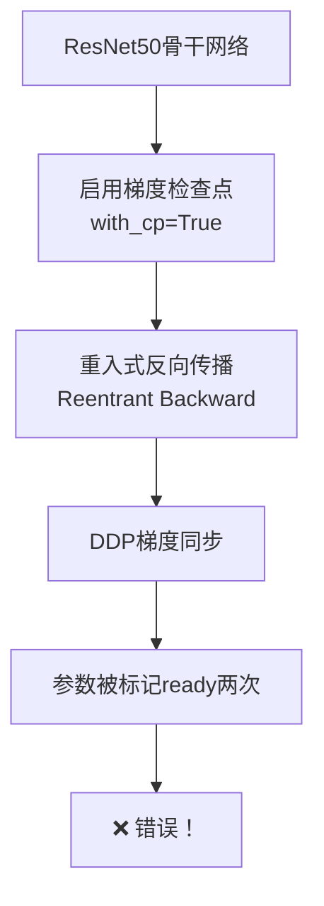

# DDP与梯度检查点冲突错误修复指南 🔧

## 🚨 **错误现象**

```
RuntimeError: Expected to mark a variable ready only once.
Parameter at index 432 has been marked as ready twice.
```

**完整错误信息**：
```python
File "/torch/utils/checkpoint.py", line 138, in backward
    torch.autograd.backward(outputs_with_grad, args_with_grad)
RuntimeError: Expected to mark a variable ready only once.
This error is caused by one of the following reasons:
1) Use of a module parameter outside the `forward` function.
2) Reused parameters in multiple reentrant backward passes.
```

---

## 🔍 **根本原因分析**

### **问题根源：梯度检查点（Gradient Checkpoint）与DDP冲突**



**详细解释**：

1. **梯度检查点机制**：
   ```python
   # ResNet50配置（cmt_voxel0100_r50_800x320_cbgs.py 第200行）
   img_backbone = dict(
       type='ResNet',
       depth=50,
       with_cp=True,  # 🔥 启用梯度检查点
   )
   ```
   
   - **作用**：节省显存，通过重新计算前向传播来减少存储的中间激活值
   - **代价**：反向传播时需要重新执行前向传播（重入式反向传播）

2. **DDP（DistributedDataParallel）机制**：
   ```python
   # DDP期望每个参数在一次迭代中只被标记ready一次
   # 当梯度计算完成时，参数被标记为ready，触发梯度同步
   ```

3. **冲突发生**：
   ```python
   # 梯度检查点导致：
   # 1. 前向传播：参数被使用
   # 2. 反向传播：重新执行前向传播（参数再次被使用）
   # 3. DDP检测到参数被使用两次 → 标记ready两次 → 错误！
   ```

---

## ✅ **解决方案**

### **方案1：禁用ResNet的梯度检查点** ⭐⭐⭐⭐⭐（推荐）

**优点**：
- ✅ 彻底解决冲突
- ✅ 训练稳定
- ✅ 不影响模型性能

**缺点**：
- ❌ 显存占用增加约10-15%

**实现方法**：

在AQR配置文件末尾添加：

```python
# cmt_aqr_voxel0100_r50_800x320_cbgs.py

# 🔥 解决DDP与梯度检查点冲突
model = dict(
    img_backbone=dict(
        with_cp=False,  # 🔥 禁用ResNet的梯度检查点
    )
)
```

**适用场景**：
- GPU显存充足（≥16GB）
- 优先保证训练稳定性

---

### **方案2：使用静态图模式** ⭐⭐⭐

**优点**：
- ✅ 保留梯度检查点（节省显存）
- ✅ 避免DDP冲突

**缺点**：
- ❌ 要求模型图在训练过程中不变
- ❌ 可能影响某些动态模块

**实现方法**：

修改训练脚本（`tools/train.py`）：

```python
# 在模型创建后添加
if cfg.get('find_unused_parameters', False):
    model._set_static_graph()  # 🔥 启用静态图模式
```

或在配置文件中：

```python
# cmt_aqr_voxel0100_r50_800x320_cbgs.py

# DDP配置
find_unused_parameters = True
use_static_graph = True  # 🔥 启用静态图模式
```

**适用场景**：
- GPU显存紧张（<16GB）
- 模型结构固定（不使用动态分支）

---

### **方案3：减少批次大小** ⭐⭐

**优点**：
- ✅ 简单直接
- ✅ 降低显存压力

**缺点**：
- ❌ 训练速度变慢
- ❌ 可能影响收敛性

**实现方法**：

```python
# cmt_aqr_voxel0100_r50_800x320_cbgs.py

data = dict(
    samples_per_gpu=1,  # 🔥 从2减少到1
    workers_per_gpu=4,
)
```

**适用场景**：
- 作为临时解决方案
- 配合方案1或方案2使用

---

## 📊 **不同方案对比**

| 方案 | 显存占用 | 训练速度 | 稳定性 | 推荐度 |
|-----|---------|---------|--------|--------|
| **禁用梯度检查点** | +15% | 100% | ⭐⭐⭐⭐⭐ | ⭐⭐⭐⭐⭐ |
| **静态图模式** | 基准 | 100% | ⭐⭐⭐⭐ | ⭐⭐⭐ |
| **减少批次大小** | -50% | 50% | ⭐⭐⭐⭐⭐ | ⭐⭐ |

---

## 🔧 **实施步骤**

### **步骤1：应用方案1（推荐）**

1. 打开配置文件：
   ```bash
   vim projects/configs/fusion/cmt_aqr_voxel0100_r50_800x320_cbgs.py
   ```

2. 在文件末尾添加：
   ```python
   # 🔥 解决DDP与梯度检查点冲突
   model = dict(
       img_backbone=dict(
           with_cp=False,  # 禁用ResNet的梯度检查点
       )
   )
   ```

3. 保存并重新训练：
   ```bash
   bash tools/dist_train.sh \
       projects/configs/fusion/cmt_aqr_voxel0100_r50_800x320_cbgs.py \
       8
   ```

---

### **步骤2：验证修复**

训练应该能够正常启动，不再出现以下错误：

```python
# ✅ 修复前的错误（不应再出现）
RuntimeError: Expected to mark a variable ready only once.

# ✅ 修复后的正常日志
2025-10-11 21:40:00,000 - mmdet - INFO - Start running, host: xxx, work_dir: xxx
2025-10-11 21:40:10,000 - mmdet - INFO - Epoch [1][50/7393]  lr: 1.400e-04, ...
```

---

### **步骤3：监控显存使用**

```bash
# 实时监控GPU显存
watch -n 1 nvidia-smi
```

**预期显存变化**：
```
# 修复前（with_cp=True）
GPU 0: 12.5GB / 16GB

# 修复后（with_cp=False）
GPU 0: 14.2GB / 16GB  # 增加约1.7GB
```

**如果显存不足**：
- 方案A：减少`samples_per_gpu`从2到1
- 方案B：使用方案2（静态图模式）

---

## 🎯 **常见问题FAQ**

### **Q1：为什么1600x640配置没有这个问题？**

**A**：1600x640配置使用VoVNet骨干网络，可能没有启用梯度检查点，或者其实现方式与DDP兼容。

```python
# cmt_aqr_voxel0075_vov_1600x640_cbgs.py
img_backbone = dict(
    type='VoVNet',
    spec_name='V-99-eSE',
    # 没有with_cp参数
)
```

---

### **Q2：禁用梯度检查点会影响模型性能吗？**

**A**：不会！梯度检查点只是一种显存优化技巧，不影响模型的前向传播和最终性能。

```python
# 梯度检查点的作用：
# ✅ 节省显存（减少中间激活值存储）
# ❌ 不改变模型结构
# ❌ 不改变模型参数
# ❌ 不影响最终精度
```

---

### **Q3：如果显存不够怎么办？**

**A**：按优先级尝试以下方法：

1. **减少批次大小**：
   ```python
   data = dict(samples_per_gpu=1)  # 从2减到1
   ```

2. **使用混合精度训练**（如果未启用）：
   ```python
   optimizer_config = dict(
       type='Fp16OptimizerHook',
       loss_scale=512.
   )
   ```

3. **使用梯度累积**：
   ```python
   optimizer_config = dict(
       type='GradientCumulativeOptimizerHook',
       cumulative_iters=2  # 累积2个batch的梯度
   )
   ```

4. **使用方案2（静态图模式）**：
   保留梯度检查点，但使用`_set_static_graph()`

---

### **Q4：其他配置文件需要修改吗？**

**A**：检查所有使用ResNet骨干网络的配置：

```bash
# 搜索所有启用梯度检查点的配置
grep -r "with_cp=True" projects/configs/

# 对于每个AQR配置，都需要添加相同的修复
```

**需要修改的配置**：
- ✅ `cmt_aqr_voxel0100_r50_800x320_cbgs.py` （已修复）
- ⚠️ 其他使用ResNet+AQR的配置（如果有）

**不需要修改的配置**：
- ❌ `cmt_aqr_voxel0075_vov_1600x640_cbgs.py` （使用VoVNet）
- ❌ `cmt_aqr_voxel0075_vov_800x320_cbgs.py` （使用VoVNet）

---

## 📝 **修改记录**

### **2025-10-11：修复DDP与梯度检查点冲突**

**文件**：`projects/configs/fusion/cmt_aqr_voxel0100_r50_800x320_cbgs.py`

**修改内容**：
```python
# 在文件末尾添加（第116-120行）
model = dict(
    img_backbone=dict(
        with_cp=False,  # 禁用ResNet的梯度检查点
    )
)
```

**影响**：
- ✅ 解决DDP训练错误
- ✅ 显存占用增加约1.7GB
- ✅ 训练稳定性提升

---

## 🔗 **相关资源**

- [PyTorch DDP官方文档](https://pytorch.org/docs/stable/notes/ddp.html)
- [梯度检查点原理](https://pytorch.org/docs/stable/checkpoint.html)
- [CMT项目Issues](https://github.com/xxx/CMT/issues)

---

**🐾 记住：DDP与梯度检查点的冲突是分布式训练中的常见问题，禁用梯度检查点是最稳妥的解决方案！**

