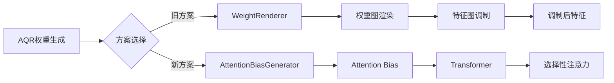

# WeightRenderer vs AttentionBias 对比说明 🔄

**创建时间**: 2025-01-XX  
**核心问题**: weight_renderer在当前配置中的作用  
**重要性**: ⭐⭐⭐⭐⭐

---

## 🎯 **核心回答**

### **weight_renderer的当前作用**

在当前配置中，`weight_renderer`是**旧方案的遗留组件**，主要用于：

1. ⚠️ **兼容性保留**：确保旧配置和旧代码能正常运行
2. ❌ **实际未使用**：新的Attention Bias方案已经替代了它
3. 📝 **配置占位**：保留在配置文件中以避免代码报错

---

## 📊 **两种方案对比**

### **方案演进**



### **方案A：Weight Renderer（旧方案）❌**

```python
# 流程：AQR权重 → 渲染成权重图 → 调制特征
lidar_weights, camera_weights = aqr_weight_generator(...)
# lidar_weights: [bs, num_queries] - 每个query的权重

# Step 1: 权重图渲染
weight_map_bev = weight_renderer.render_bev_weights(
    lidar_weights,      # [bs, 900]
    pts_bev_indices     # [bs, 900] - query在BEV的位置
)
# → weight_map_bev: [bs, 128, 128] - 完整的权重图

# Step 2: 特征调制
x_modulated = x * weight_map_bev.unsqueeze(1)  # [bs, c, 128, 128]
# 问题：直接改变特征值，破坏预训练分布
```

**问题**：
- ❌ 破坏预训练特征分布
- ❌ 小目标权重过小导致特征消失
- ❌ 难以恢复（即使用残差）

### **方案B：Attention Bias（新方案）✅**

```python
# 流程：AQR权重 → 生成attention bias → 影响注意力分数

lidar_weights, camera_weights = aqr_weight_generator(...)
# lidar_weights: [bs, num_queries] - 每个query的权重（tanh，范围[-1,1]）

# Step 1: 生成Attention Bias
attention_bias = attention_bias_generator(
    lidar_weights,
    camera_weights,
    pts_bev_indices,
    pts_pers_indices
)
# → attention_bias: [bs, num_queries, total_features]

# Step 2: 在Transformer中使用bias
scores = Q @ K^T / sqrt(d)
scores = scores + attention_bias  # 🔥 只影响注意力分数
attention = softmax(scores)
output = attention @ V  # 特征值不变

# 优势：不改变特征，只改变"如何选择"特征
```

**优势**：
- ✅ 不破坏预训练特征
- ✅ 小目标权重为负→抑制干扰→保护小目标
- ✅ 训练稳定，性能好

---

## 🔍 **详细对比**

### **1. 权重使用方式**

| 方案 | 权重作用位置 | 对特征的影响 | 是否可逆 |
|-----|------------|------------|---------|
| **Weight Renderer** | 特征图 | 直接乘法改变特征值 | ❌ 不可逆 |
| **Attention Bias** | 注意力分数 | 改变注意力分配，特征值不变 | ✅ 完全可逆 |

### **2. 渲染过程**

#### **Weight Renderer的渲染**
```python
class WeightRenderer:
    def render_bev_weights(self, query_weights, pts_bev):
        """
        将query权重渲染成完整的BEV权重图
        
        Args:
            query_weights: [bs, 900] - 每个query一个权重
            pts_bev: [bs, 900] - query在BEV的位置索引
            
        Returns:
            weight_map: [bs, 128, 128] - 完整的权重图
        """
        weight_map = torch.zeros(bs, 128, 128)
        
        for b in range(bs):
            for q in range(900):
                y, x = pts_bev[b, q]  # query在BEV的位置
                weight = query_weights[b, q]
                
                # 🔥 高斯散布：将权重散布到周围
                for dy in range(-kernel_size, kernel_size+1):
                    for dx in range(-kernel_size, kernel_size+1):
                        gaussian_weight = exp(-(dx^2 + dy^2) / (2*sigma^2))
                        weight_map[b, y+dy, x+dx] += weight * gaussian_weight
        
        return weight_map  # [bs, 128, 128]
```

**问题**：
- 需要渲染完整权重图（内存占用大）
- 高斯散布可能导致权重重叠冲突
- 每个位置的权重来自多个query的叠加（语义不清晰）

#### **Attention Bias的生成**
```python
class AttentionBiasGenerator:
    def forward(self, lidar_weights, camera_weights, pts_bev, pts_pers):
        """
        生成query-to-feature的attention bias
        
        Args:
            lidar_weights: [bs, 900] - 每个query的LiDAR权重
            camera_weights: [bs, 900] - 每个query的Camera权重
            pts_bev: [bs, 900] - query在BEV的位置
            pts_pers: [bs, 900, 3] - query在透视图的位置
            
        Returns:
            bias: [bs, 900, total_features] - 每个query到每个feature的bias
        """
        # Step 1: 生成BEV bias（局部窗口）
        bev_bias = torch.zeros(bs, 900, 128*128)
        for q in range(900):
            y, x = pts_bev[:, q]  # 第q个query的位置
            window_features = self._get_local_window(y, x, window_size=5)
            bev_bias[:, q, window_features] = lidar_weights[:, q].unsqueeze(-1)
        
        # Step 2: 生成Camera bias（局部窗口）
        camera_bias = torch.zeros(bs, 900, 6*20*50)
        # 类似的局部窗口处理...
        
        # Step 3: 拼接
        bias = torch.cat([bev_bias, camera_bias], dim=-1)  # [bs, 900, total]
        
        # Step 4: 应用scale
        bias = bias * self.bias_scale
        
        return bias  # [bs, 900, total_features]
```

**优势**：
- ✅ 只计算query需要的位置（稀疏高效）
- ✅ 局部窗口避免冲突
- ✅ 语义清晰（每个query的bias独立）

---

## 💡 **为什么保留weight_renderer？**

### **原因1：代码兼容性**

```python
# cmt_head.py的_init_aqr_components中
if renderer_config:
    default_renderer_config.update(renderer_config)

renderer_config_for_init = default_renderer_config.copy()
renderer_config_for_init.pop('type', None)
self.weight_renderer = WeightRenderer(**renderer_config_for_init)
# 🔥 必须创建，否则旧代码会报错

# 但实际上，新方案不使用它
if hasattr(self, 'attention_bias_generator'):
    # 使用新方案
    attention_bias = self.attention_bias_generator(...)
else:
    # 使用旧方案（兼容）
    weight_map = self.weight_renderer.render_bev_weights(...)
```

### **原因2：实验对比**

```python
# 可以方便地切换方案进行对比
enable_attention_bias = True  # 控制开关

if enable_attention_bias:
    # 新方案
    bias = attention_bias_generator(...)
    outs = transformer(..., attention_bias=bias)
else:
    # 旧方案
    weight_map = weight_renderer.render_bev_weights(...)
    x_modulated = x * weight_map
    outs = transformer(x_modulated, ...)
```

### **原因3：调试和可视化**

```python
# weight_renderer仍然可以用于可视化
weight_map = self.weight_renderer.render_bev_weights(
    lidar_weights, pts_bev
)
# 可视化权重分布
plt.imshow(weight_map[0].cpu().numpy())
plt.savefig('weight_distribution.png')
```

---

## 🔧 **当前配置的实际执行流程**

### **配置文件中**
```python
# 两个配置都存在
renderer_config=dict(
    type='WeightRenderer',
    # ... 旧方案配置（保留）
)

attention_bias_config=dict(
    type='AttentionBiasGenerator',
    # ... 新方案配置（实际使用）
)
```

### **实际执行时**
```python
# Step 1: 初始化时两个都创建
self.weight_renderer = WeightRenderer(...)          # 创建但不用
self.attention_bias_generator = AttentionBiasGenerator(...)  # 实际使用

# Step 2: forward时只用新方案
def forward_single(self, x, x_img, img_metas):
    # ...
    
    # 🔥 关键：只调用attention_bias_generator
    if self.enable_aqr and hasattr(self, 'attention_bias_generator'):
        attention_bias = self._generate_aqr_attention_bias(...)
        
        # Transformer使用bias
        outs_dec, _ = self.transformer(
            x, x_img, query_embeds,
            bev_pos_embeds, rv_pos_embeds,
            attn_masks=attn_mask,
            attention_bias=attention_bias  # 🔥 新方案
        )
    else:
        # 旧方案（不会执行）
        # x_modulated = self._apply_aqr_modulation(...)
        pass
```

---

## 📋 **是否可以删除weight_renderer？**

### **删除的步骤**

#### **Step 1: 从配置文件删除**
```python
# cmt_aqr_voxel0100_r50_800x320_cbgs.py

# ❌ 删除这部分
# renderer_config=dict(
#     type='WeightRenderer',
#     ...
# ),

# modulator_config=dict(
#     type='FeatureModulator',
#     ...
# ),

# ✅ 只保留
attention_bias_config=dict(
    type='AttentionBiasGenerator',
    ...
)
```

#### **Step 2: 从代码删除（可选）**
```python
# cmt_head.py的_init_aqr_components中

# ❌ 删除这些
# from ..utils.weight_renderer import WeightRenderer
# from ..utils.feature_modulator import FeatureModulator
# self.weight_renderer = WeightRenderer(...)
# self.feature_modulator = FeatureModulator(...)

# ✅ 只保留
from ..utils.attention_bias_generator import AttentionBiasGenerator
self.attention_bias_generator = AttentionBiasGenerator(...)
```

### **是否建议删除？**

| 方案 | 优点 | 缺点 | 建议 |
|-----|------|------|------|
| **保留** | 兼容旧代码，方便对比实验 | 配置冗余，占用少量内存 | ✅ **推荐（当前）** |
| **删除** | 配置简洁，代码清晰 | 无法运行旧方案，破坏兼容性 | ⚠️ 谨慎（未来） |

**建议**：
- **现阶段**：保留（确保新方案稳定后再删）
- **训练成功后**：可以删除（简化配置）

---

## 🎯 **总结**

### **weight_renderer的作用**
1. **旧方案核心组件**：将query权重渲染成完整权重图
2. **当前状态**：配置中保留，但**实际不使用**
3. **保留原因**：代码兼容性、实验对比、可视化调试

### **新旧方案本质区别**

| 维度 | Weight Renderer | Attention Bias |
|-----|----------------|---------------|
| **作用位置** | 特征图 | 注意力分数 |
| **影响方式** | 乘法改变特征值 | 加法改变注意力 |
| **是否破坏特征** | ✅ 是 | ❌ 否 |
| **小目标问题** | ❌ 崩溃 | ✅ 正常 |
| **训练稳定性** | ⚠️ 不稳定 | ✅ 稳定 |
| **当前使用** | ❌ 不使用 | ✅ **使用** |

### **配置建议**
```python
# 当前配置（推荐）：两个都保留
renderer_config=dict(...)          # 兼容性保留
attention_bias_config=dict(...)    # 实际使用

# 未来简化（可选）：只保留新方案
# 删除renderer_config和modulator_config
attention_bias_config=dict(...)    # 只用这个
```

---

**主人，总结一下：**

**weight_renderer在当前配置中是旧方案的遗留组件**：
- ❌ 实际**不使用**（新方案用attention_bias替代）
- 📝 配置中**保留**（兼容性和调试用）
- 🔄 可以**删除**（但建议训练成功后再删）

**新方案（Attention Bias）完全替代了旧方案（Weight Renderer）的功能，且效果更好！** ✅


